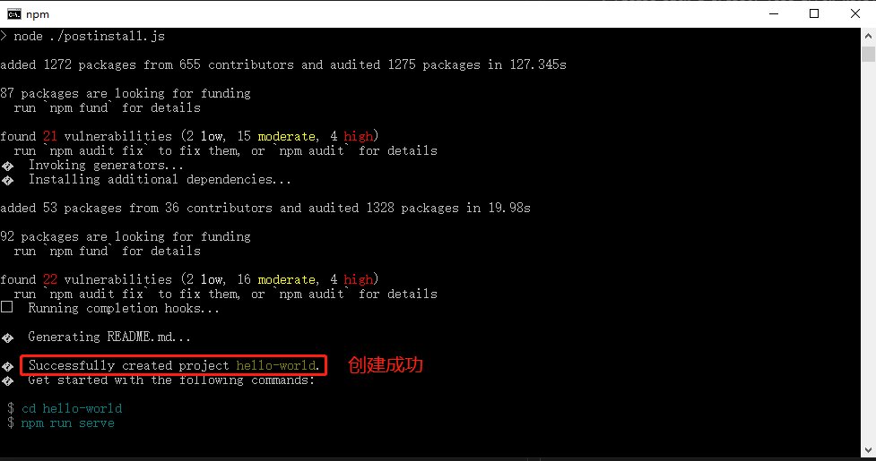

<!--
 * @Description: 脚手架
 * @Author: shenxh
 * @Date: 2022-02-16 15:32:11
 * @LastEditors: shenxh
 * @LastEditTime: 2022-02-16 16:59:03
-->

- [介绍](#介绍)
- [安装](#安装)
  - [ndoe](#ndoe)
  - [vue-cli](#vue-cli)
- [创建](#创建)
  - [提示](#提示)

> [官网地址](https://cli.vuejs.org/zh/)

# 介绍
Vue CLI 是一个基于 Vue.js 进行快速开发的完整系统

# 安装
## [ndoe](http://nodejs.cn/download/)

> 注: node 版本不能太低, 但也不推荐太高, 一般 12.x 或 14.x 即可. 当然每个 vue 项目可能对 node 版本要求不一样, 可通过 [nvm](https://github.com/coreybutler/nvm-windows/releases/download/1.1.9/nvm-setup.zip) 进行 node 版本切换

node 已安装的话可以直接跳过这一步, 可输入以下命令查看 node 是否安装
```
node -v

// 如显示对应 node 版本, 如: v14.16.0, 则代表已安装 node
```

可点击下面安装包进行下载安装 (安装时, 一直点击"下一步"即可)

[Windows 安装包 (v12.22.10)](https://registry.npmmirror.com/-/binary/node/latest-v12.x/node-v12.22.10-x64.msi)


## vue-cli
```
npm install -g @vue/cli
```

# 创建
运行以下命令来创建一个新项目 (hello-world)：
```
vue create hello-world
```

## 提示
```
// 你与默认的纱线注册表的连接似乎很慢
? Your connection to the default yarn registry seems to be slow.

  // 使用 https://registry.npm.taobao.org (淘宝镜像) 来加快安装速度? (Y/n)
  Use https://registry.npm.taobao.org for faster installation? (Y/n)

输入 "n", 回车
```
```
// 请选择一个预设值：（使用箭头键）
? Please pick a preset: (Use arrow keys)

> Default ([Vue 2] babel, eslint)
  Default (Vue 3) ([Vue 3] babel, eslint)
  Manually select features

我们创建 Vue 2 项目, 所以选择第一项即可, 直接回车
```
```
// 请选择预设
? Please pick a preset: Default ([Vue 2] babel, eslint)
// 选择要在安装依赖项时使用的程序包管理器:（使用箭头键）
? Pick the package manager to use when installing dependencies: (Use arrow keys)

> Use Yarn
  Use NPM

下方向键, 选择 "Use NPM", 回车
```



创建成功后, 可用 VS Code 编辑器打开该项目

输入 `npm run serve` 运行项目

运行成功后在浏览器地址栏输入 `http://localhost:8080` 查看页面
