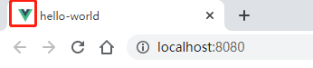

<!--
 * @Description: 项目目录解析
 * @Author: shenxh
 * @Date: 2022-02-17 08:58:28
 * @LastEditors: shenxh
 * @LastEditTime: 2022-02-17 13:27:14
-->

- [`node_modules`](#node_modules)
- [`public`](#public)
  - [`favicon.ico`](#faviconico)
  - [`index.html`](#indexhtml)
- [`src`](#src)
  - [`assets`](#assets)
    - [`css`](#css)
    - [`font`](#font)
    - [`img`](#img)
    - [`js`](#js)
  - [`components`](#components)
  - [`router`](#router)
  - [`store`](#store)
  - [`utils`](#utils)
  - [`views`](#views)
  - [`App.vue`](#appvue)
  - [`main.js`](#mainjs)
- [`.gitignore`](#gitignore)
- [`babel.config.js`](#babelconfigjs)
- [`package-lock.json`](#package-lockjson)
- [`package.json`](#packagejson)
- [`README.md`](#readmemd)

# `node_modules`
npm 加载的项目依赖模块

# `public`
存放一些公共资源 (不会被 webpack 打包)

## `favicon.ico`
浏览器标签图标



## `index.html`
首页入口文件

# `src`
项目开发的目录, 基本上要做的事情都在这个目录里

## `assets`
放置静态资源, 包括公共的 css 文件、js 文件、iconfont 字体文件、img 图片文件以及其他资源类文件. 之所以强调是公共的 css 文件, 是因为要在组件的 css 标签里加入 `scoped` 标记, 将其作用范围限制在此组件以及调用它的父级组件中, 避免污染全局样式

### `css`
用于存放样式文件

### `font`
用于存放字体文件

### `img`
用于存放图片

### `js`
用于存放脚本文件

## `components`
放置通用模块组件. 项目里总会有一些复用的组件, 例如弹出框、发送手机验证码、图片上传等, 将它们作为通用组件, 避免重复工作

## `router`
放置路由配置文件

## `store`
放置 vuex 需要的状态关联文件

## `utils`
放置一些公共的方法, 例如: 日期格式化、数据校验规则等

## `views`
放置主要页面的组件. 通常是这里的组件本身写入一些结构, 再引入通用模块组件, 形成完整的页面

## `App.vue`
项目入口组件, views 里的组件会被插入此组件中, 此组件再插入到 `index.html` 文件里, 形成**单页面**应用

## `main.js`
入口 js 文件, 影响全局, 作用是引入全局使用的库、公共样式和方法等

# `.gitignore`
git 配置文件, 告诉 git 哪些文件不需要上传至 git 仓库

# `babel.config.js`
Babel 的配置文件, 将 ES6 转换为 ES5, 兼容旧版本浏览器

# `package-lock.json`
锁定安装时的包的版本号, 并且需要上传到 git, 以保证其他人在 `npm install` 时大家的依赖能保证一致

# `package.json`
定义了这个项目所需要的各种模块, 以及项目的配置信息 (比如名称、版本、许可证等元数据). `npm install` 命令根据这个配置文件, 自动下载所需的模块, 也就是配置项目所需的运行和开发环境

```
{
  "name": "hello-world", // 项目名称 
  "version": "0.1.0", // 项目版本
  "private": true, // 项目描述
  "scripts": { // 指定了运行脚本命令的 npm 命令行缩写
    "serve": "vue-cli-service serve", // npm run serve: 启动本地项目
    "build": "vue-cli-service build", // npm run build: 本地项目打包, 完成后会生成一个 dist 打包文件
    "lint": "vue-cli-service lint" // npm run lint: 全局代码检测
  },
  "dependencies": { // 指定了项目运行所依赖的模块
    "core-js": "^3.6.5",
    "vue": "^2.6.11"
  },
  "devDependencies": { // 指定了项目开发所需要的模块
    "@vue/cli-plugin-babel": "~4.5.0",
    "@vue/cli-plugin-eslint": "~4.5.0",
    "@vue/cli-service": "~4.5.0",
    "babel-eslint": "^10.1.0",
    "eslint": "^6.7.2",
    "eslint-plugin-vue": "^6.2.2",
    "vue-template-compiler": "^2.6.11"
  },
  "eslintConfig": { // eslint 相关配置
    "root": true,
    "env": {
      "node": true
    },
    "extends": [
      "plugin:vue/essential",
      "eslint:recommended"
    ],
    "parserOptions": {
      "parser": "babel-eslint"
    },
    "rules": {}
  },
  "browserslist": [ // 根据提供的目标浏览器的环境来智能添加 css 前缀, 达到兼容旧版本浏览器的目的
    "> 1%", // 全球超过1%人使用的浏览器
    "last 2 versions", // 所有浏览器兼容到最后两个版本根据 CanIUse.com 追踪的版本
    "not dead"
  ]
}

```

对应的版本可以加上各种限定, 主要有以下几种：

> **指定版本**：比如 1.2.2, 遵循 "大版本, 次要版本, 小版本" "的格式规定, 安装时只安装指定版本
> 
> **波浪号 (tilde) + 指定版本**：比如 ~1.2.2, 表示安装 1.2.x 的最新版本 (不低于 1.2.2) , 但是不安装 1.3.x, 也就是说安装时不改变大版本号和次要版本号
>
> **插入号 (caret) + 指定版本**：比如 ˆ1.2.2, 表示安装 1.x.x 的最新版本 (不低于1.2.2) , 但是不安装 2.x.x, 也就是说安装时不改变大版本号. 需要注意的是, 如果大版本号为 0, 则插入号的行为与波浪号相同, 这是因为此时处于开发阶段, 即使是次要版本号变动, 也可能带来程序的不兼容
>
> **latest**：安装最新版本

package.json 文件可以手工编写, 也可以使用 `npm init` 命令自动生成

这个命令采用互动方式, 要求用户回答一些问题, 然后在当前目录生成一个基本的 package.json 文件. 所有问题之中, 只有项目名称 (name) 和项目版本 (version) 是必填的, 其他都是选填的

有了 package.json 文件, 直接使用 `npm install` 命令, 就会在当前目录中安装所需要的模块

如果一个模块不在 package.json 文件之中, 可以单独安装这个模块, 并使用相应的参数, 将其写入 package.json 文件之中

```
// 将 express 模块写入 dependencies 属性中
npm install express --save

// 将 express 模块写入 devDependencies 属性中
npm install express --save-dev
```

# `README.md`
项目说明文档, 遵循 markdown 语法
