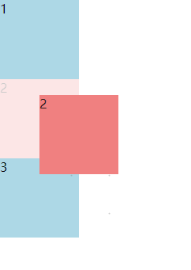
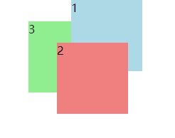

<!--
 * @Author: shenxh
 * @Date: 2021-12-13 17:09:57
 * @LastEditors: shenxh
 * @LastEditTime: 2021-12-15 16:47:53
 * @Description: CSS 定位与层级
-->

- [定位](#定位)
  - [相对定位 `relative`](#相对定位-relative)
  - [绝对定位 `absolute`](#绝对定位-absolute)
  - [固定定位 `fixed`](#固定定位-fixed)
- [层级](#层级)

# 定位

## 相对定位 `relative`
如果对一个元素进行相对定位, 可以通过设置垂直或水平位置，让这个元素相对于它的初始位置进行移动

> 注: 在使用相对定位时，无论是否进行移动，元素**仍占据原来的空间**

```
<div class="wrap">
    <div class="box box1">1</div>
    <div class="box box2">2</div>
    <div class="box box3">3</div>
</div>
```
```
.wrap {
    width: 500px;
    height: 300px;
    margin: 100px auto;
    border: 1px solid #000;
}
.box {
    width: 100px;
    height: 100px;
    background-color: lightblue;
}
.box2 {
    position: relative; /* 设置相对定位 */

    top: 20px;
    left: 50px;
    background-color: lightcoral;
}
```

页面效果:

> 注: 半透明的元素代表定位之前的默认位置, 仅仅为了方便理解, 实际页面中是不存在的



## 绝对定位 `absolute`
绝对定位的元素的位置相对于最近的已定位父元素，如果元素没有已定位的父元素，那么它的位置相对于根节点 `<html>`

特点:
+ `absolute` 定位使元素的位置与文档流无关，因此**不占据空间**
+ `absolute` 定位的元素和其他元素**重叠**

```
<div class="box box1">1</div>
<div class="wrap">
    <div class="box box2">2</div>
</div>
```
```
.wrap {
    position: relative; /* 设置相对定位 */

    width: 500px;
    height: 300px;
    margin: 100px auto;
    border: 1px solid #000;
}
.box {
    position: absolute; /* 设置绝对定位 */

    width: 100px;
    height: 100px;
}
.box1 {
    top: 20px;
    left: 50px;
    background-color: lightblue;
}
.box2 {
    top: 20px;
    left: 50px;
    background-color: lightcoral;
}
```

页面效果:

> 注: 半透明的元素代表定位之前的默认位置, 仅仅为了方便理解, 实际页面中是不存在的


可以看到, 当给 `.box` 设置绝对定位, `.wrap` 设置相对定位后, 由于 `.box2` 是 `.wrap` 的子元素, 所以 `.box2` 是相对于 `.wrap` 元素定位的; 而 `.box1` 的父元素没有相对定位, 所以 `.box1`
是相对于根元素 `<html>` 定位的

> 注: 设置绝对定位时, 一般要将该元素的父级元素设置为相对定位, 简称 **父相子绝**

## 固定定位 `fixed`
元素的位置相对于**浏览器窗口**固定

即使窗口是滚动的它也不会移动

特点:
+ 固定定位使元素的位置与文档流无关, 因此**不占据空间**
+ 固定定位的元素和其他元素**重叠**

# 层级
当使用定位时, 可能会导致多个元素重叠, 那么怎样控制谁在前, 谁在后呢?

`z-index` 属性可以设置元素的堆叠顺序,  拥有更高堆叠顺序的元素总是会处于堆叠顺序较低的元素的前面

特点:
+ `z-index` 可为任意**整数** (负数/0/正数均可, 默认为 0)
+ `z-index` 仅在**定位元素**上有效 (如: `position: absolute;`)

```
<div class="box box1">1</div>
<div class="box box2">2</div>
<div class="box box3">3</div>
```
```
.box {
    position: absolute; /* 设置绝对定位 */

    width: 100px;
    height: 100px;
}
.box1 {
    top: 0;
    left: 100px;
    background-color: lightblue;

    z-index: 1; /* 设置层级为 1 */
}
.box2 {
    top: 60px;
    left: 80px;
    background-color: lightcoral;

    z-index: 999; /* 设置层级为 999 */
}
.box3 {
    top: 30px;
    left: 40px;
    background-color: lightgreen;

    z-index: -1; /* 设置层级为 -1 */
}
```

页面效果:

