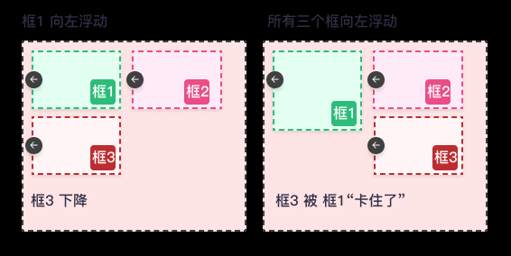
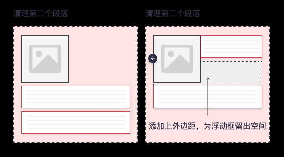

<!--
 * @Author: shenxh
 * @Date: 2021-12-13 17:13:27
 * @LastEditors: shenxh
 * @LastEditTime: 2021-12-15 16:51:04
 * @Description: CSS 浮动
-->

- [CSS 浮动](#css-浮动)
  - [属性](#属性)
  - [原理解析](#原理解析)
    - [示例1](#示例1)
    - [示例2](#示例2)
    - [示例3](#示例3)
  - [行框和清理](#行框和清理)
  - [清除浮动](#清除浮动)

# CSS 浮动
用 `float` 属性给元素添加浮动

浮动的框可以向左或向右移动，直到它的外边缘碰到包含框或另一个浮动框的边框为止

由于浮动框不在文档的普通流中，所以文档的普通流中的块框表现得就像浮动框不存在一样

注: 
+ 绝对定位 `absolute` 和固定定位 `fixed` 的元素不支持浮动
+ 浮动元素会影响其他行内元素和行内块元素的排版, 使它们"环绕"在浮动元素的周围

```
<div class="wrap">
    <div class="box box1">1</div>
    <div class="box box2">2</div>
    <div class="box box3">3</div>
</div>
```
```
.wrap {
    width: 500px;
    height: 350px;
    margin: 100px auto;
    border: 1px solid #000;
}
.box {
    width: 100px;
    height: 100px;
}
.box1 {
    float: left;
    background: lightblue;
}
.box2 {
    float: left;
    background: lightcoral;
}
.box3 {
    clear: both;
    background: lightgreen;
}
```

## 属性
|值|描述|
|-|-|
|left|元素向左浮动|
|right|元素向右浮动|
|none|[默认]元素不浮动，并会显示在其在文本中出现的位置|
|inherit|规定应该从父元素继承 float 属性的值|

## 原理解析

### 示例1


当把框 1 向右浮动时，它脱离文档流并且向右移动，直到它的右边缘碰到包含框的右边缘

### 示例2


当框 1 向左浮动时，它脱离文档流并且向左移动，直到它的左边缘碰到包含框的左边缘。因为它不再处于文档流中，所以它不占据空间，实际上覆盖住了框 2，使框 2 从视图中消失

如果把所有三个框都向左移动，那么框 1 向左浮动直到碰到包含框，另外两个框向左浮动直到碰到前一个浮动框

### 示例3


如果包含框太窄，无法容纳水平排列的三个浮动元素，那么其它浮动块向下移动，直到有足够的空间。如果浮动元素的高度不同，那么当它们向下移动时可能被其它浮动元素"卡住"

## 行框和清理
浮动框旁边的行框被缩短，从而给浮动框留出空间，行框围绕浮动框

因此，创建浮动框可以使文本围绕图像：


要想阻止行框围绕浮动框，需要对该框应用 clear 属性。clear 属性的值可以是 left、right、both 或 none，它表示框的哪些边不应该挨着浮动框

为了实现这种效果，在被清理的元素的上外边距上添加足够的空间，使元素的顶边缘垂直下降到浮动框下面：



```
<div class="wrap">
    <div class="img">这是图片</div>
    <p class="content content1">
        这是一条很长很长很长的数据
    </p>
    <p class="content content2">
        这是另一条很长很长很长很长很长很长很长很长的数据
    </p>
</div>
```
```
.wrap {
    width: 300px;
    height: 180px;
    margin: 100px auto;
    border: 1px solid #000;
}
.img {
    float: left;
    width: 150px;
    height: 80px;
    margin: 0 10px 10px 0;
    border: 3px dashed #f00;
    background: rgba(255, 0, 0, 0.05);
}
.content {
    line-height: 1.5;
}
.content2 {
    clear: both; /* 在左右两侧均不允许浮动元素 */
}
```

## 清除浮动
当一个元素的所有子元素都是用浮动后, 它的高度将不会被撑起

解决方式也很简单, 我们一般使用伪类清除浮动

举例:
```
<div class="wrap">
    <div class="content">
        <div class="box box1">1</div>
        <div class="box box2">2</div>
        <div class="box box3">3</div>
    </div>
</div>
```
```
.wrap {
    width: 500px;
    height: 350px;
    margin: 100px auto;
    border: 1px solid #000;
}
.content {
    border: 3px dashed #f00;
    background: rgba(255, 0, 0, 0.05);
}
/* 父元素使用伪元素清除浮动 */
.content::after {
    content: '';
    display: block;
    clear: both;
}
.box {
    width: 100px;
    height: 100px;
}
.box1 {
    float: right;
    background: lightblue;
}
.box2 {
    float: left;
    background: lightcoral;
}
.box3 {
    float: left;
    background: lightgreen;
}
```
