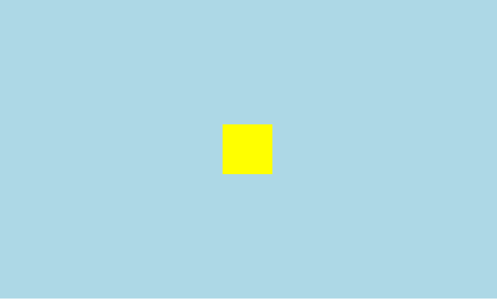

<!--
 * @Author: shenxh
 * @Date: 2021-12-13 17:14:34
 * @LastEditors: shenxh
 * @LastEditTime: 2021-12-16 09:52:06
 * @Description: CSS 居中对齐
-->

- [块元素](#块元素)
  - [定位 + `margin` 偏移](#定位--margin-偏移)
  - [定位 + `translate` 偏移](#定位--translate-偏移)
  - [利用 `margin: auto;` 自动分配剩余空间](#利用-margin-auto-自动分配剩余空间)
  - [Flex 布局 (推荐)](#flex-布局-推荐)
- [行内元素](#行内元素)
  - [文本居中 + 设置行高](#文本居中--设置行高)
  - [Flex 布局](#flex-布局)

# 块元素
居中问题无论在工作还是在面试中, 都是很常见的

下面介绍的几种方法都要掌握哦!

效果如下图所示:

  


## 定位 + `margin` 偏移
> 缺点: 必须设置宽高, 否则不能确定偏移的距离

+ html
```
<div class="father">
    <div class="son"></div>
</div>
```
+ css
```
.father {
    position: relative;
    width: 1000px;
    height: 600px;
    background: lightblue;
}
.son {
    position: absolute;
    top: 50%; /* 设为父元素的一半 */
    left: 50%; /* 设为父元素的一半 */
    margin-top: -50px; /* 高度的一半 */
    margin-left: -50px; /* 宽度的一半 */

    width: 100px;
    height: 100px;
    background: yellow;
}
```
## 定位 + `translate` 偏移
+ html
```
<div class="father">
    <div class="son"></div>
</div>
```
+ css
```
.father {
    position: relative;

    width: 1000px;
    height: 600px;
    background: lightblue;
}
.son {
    position: absolute;
    top: 50%; /* 设为父元素的一半 */
    left: 50%; /* 设为父元素的一半 */
    transform: translate(-50%, -50%); /* 上左各偏移 50% */

    width: 100px;
    height: 100px;
    background: yellow;
}
```

## 利用 `margin: auto;` 自动分配剩余空间
> 缺点: 目标元素必需设置宽高, 否则会100%填充

+ html
```
<div class="father">
    <div class="son"></div>
</div>
```
+ css
```
.father {
    position: relative;

    width: 1000px;
    height: 600px;
    background: lightblue;
}
.son {
    position: absolute;
    /* 上下左右设为相等的距离 */
    top: 0;
    right: 0;
    bottom: 0;
    left: 0;
    margin: auto; /* 自动分配多余空间 */

    width: 100px;
    height: 100px;
    background: yellow;
}
```
注: 
+ `top`、`left`、`right`、`bottom` 可为任意相等的数值
+ 目标元素需设置宽高

## Flex 布局 (推荐)
+ html
```
<div class="father">
    <div class="son"></div>
</div>
```
+ css
```
.father {
    display: flex; /* 指定为Flex布局 */
    justify-content: center; /* 水平居中 */
    align-items: center; /* 垂直居中 */

    width: 1000px;
    height: 600px;
    background: lightblue;
}
.son {
    width: 100px;
    height: 100px;
    background: yellow;
}
```

# 行内元素

## 文本居中 + 设置行高
+ html
```
<div class="father">
    <span class="son">123456789</span>
</div>
```
+ css
```
.father {
    text-align: center; /* 水平居中 */
    line-height: 180px; /* 把行高设为和高度一样 */

    width: 300px;
    height: 180px;
    margin: 100px auto;
    border: 1px solid #000;
}
```

## Flex 布局
+ html
```
<div class="father">
    <span class="son">123456789</span>
</div>
```
+ css
```
.father {
    display: flex; /* 指定为Flex布局 */
    justify-content: center; /* 水平居中 */
    align-items: center; /* 垂直居中 */

    width: 300px;
    height: 180px;
    margin: 100px auto;
    border: 1px solid #000;
}
```
