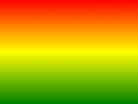
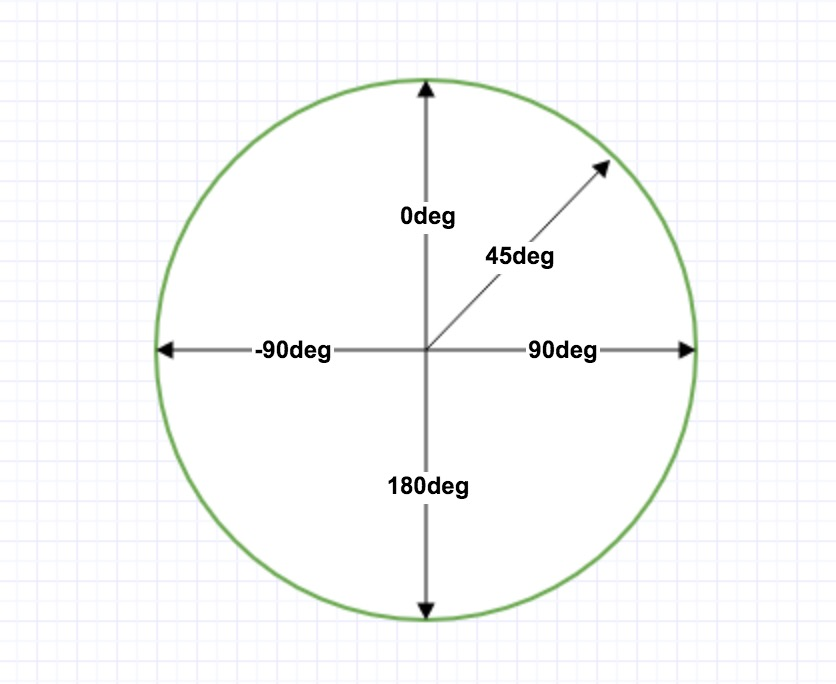
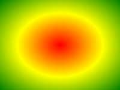

<!--
 * @Author: shenxh
 * @Date: 2021-12-13 17:20:56
 * @LastEditors: shenxh
 * @LastEditTime: 2021-12-15 16:53:11
 * @Description: CSS3 阴影与渐变
-->

- [阴影](#阴影)
  - [元素阴影](#元素阴影)
    - [语法](#语法)
  - [文字阴影](#文字阴影)
    - [语法](#语法-1)
  - [举例](#举例)
- [渐变](#渐变)
  - [线性渐变](#线性渐变)
    - [方向渐变](#方向渐变)
      - [语法](#语法-2)
      - [举例](#举例-1)
    - [角度渐变](#角度渐变)
      - [语法](#语法-3)
      - [举例](#举例-2)
    - [重复线性渐变](#重复线性渐变)
      - [举例](#举例-3)
  - [径向渐变](#径向渐变)
    - [基本](#基本)
      - [语法](#语法-4)
      - [举例](#举例-4)
    - [重复径向渐变](#重复径向渐变)
      - [举例](#举例-5)

# 阴影

## 元素阴影

### 语法
```
box-shadow: h-shadow v-shadow blur spread color inset;
```

## 文字阴影

### 语法
```
text-shadow: h-shadow v-shadow blur color;
```

|值|作用|
|-|-|
|h-shadow|[必填]阴影的水平偏移量<br />正值代表阴影向右偏移<br />负值代表阴影向左偏移|
|v-shadow|[必填]阴影的垂直偏移量<br />正值代表阴影向下偏移<br />负值代表阴影向上偏移|
|blur|模糊值, 默认为 0<br />值越大盒子的边界越模糊|
|spread|阴影的延伸半径|<br />正值代表阴影向盒子各个方向延伸扩大<br />负值代表阴影沿相反方向缩小|
|color|阴影的颜色|
|inset|是否设为内部阴影|布尔值 (true/false)|

## 举例
```
<div>测试</div>
```
```
div {
    width: 100px;
    height: 100px;
    margin: 100px auto;

    box-shadow: 2px 8px 20px rgba(0, 0, 0, 0.1);
    text-shadow: 1px 3px 5px rgba(255, 0, 0, 1);
}
```

# 渐变

## 线性渐变


创建一个线性渐变，至少定义两种颜色节点

同时，也可以设置一个起点和一个方向（或一个角度）

### 方向渐变

#### 语法
```
background-image: linear-gradient(direction, color-stop1, color-stop2, ...);
```

#### 举例
```
div {
    width: 200px;
    height: 100px;

    /* [默认]从上到下: 红>黄>绿 */
    background: linear-gradient(#f00, #ff0, #0f0);
    /* 从左到右: 红>黄>绿 */
    background: linear-gradient(to right, #f00, #ff0, #0f0);
    /* 从左上角到右下角: 红>黄>绿 */
    background: linear-gradient(to right bottom, #f00, #ff0, #0f0);
}
```

### 角度渐变


可以把角度看作钟表:
+ 0点: 0deg
+ 3点: 90deg
+ 6点: 180deg
+ 9点: 270deg
+ 12点: 360deg

#### 语法
```
background-image: linear-gradient(angle, color-stop1, color-stop2);
```

#### 举例
```
div {
    width: 200px;
    height: 100px;

    /* 向 60° 角方向渐变 */
    background: linear-gradient(60deg, #f00, #ff0, #0f0);
}
```

### 重复线性渐变

#### 举例
```
div {
    width: 200px;
    height: 100px;

    /* 百分号表示颜色停止位置 */
    background: repeating-linear-gradient(
        #f00 0%,
        #ff0 25%,
        #0f0 50%
    );
}
```
## 径向渐变


径向渐变由它的中心定义

创建一个径向渐变，至少定义两种颜色节点

同时，也可以指定渐变的中心、形状（圆形或椭圆形）、大小

默认情况下，渐变的中心是 center（表示在中心点），渐变的形状是 ellipse（表示椭圆形），渐变的大小是 farthest-corner（表示到最远的角落）

### 基本

#### 语法
```
background-image: radial-gradient(shape size at position, start-color, ..., last-color);
```

#### 举例
```
div {
    width: 200px;
    height: 100px;

    /* 均匀渐变-从中间到四周: 红>黄>绿 */
    background: radial-gradient(#f00, #ff0, #0f0);
    /* 指定颜色停止位置-从中间到四周: 红>黄>绿 */
    background: radial-gradient(#f00 10%, #ff0 50%, #0f0 100%);
    /* 圆形渐变-从中间到四周: 红>黄>绿 */
    background: radial-gradient(circle, #f00, #ff0, #0f0);
}
```

### 重复径向渐变

#### 举例
```
div {
    width: 200px;
    height: 100px;

    /* 百分号表示颜色停止位置 */
    background: repeating-radial-gradient(
        #f00 0%,
        #ff0 25%,
        #0f0 50%
    );
}
```
