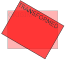
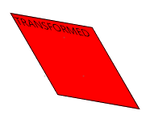

<!--
 * @Author: shenxh
 * @Date: 2021-12-13 17:21:15
 * @LastEditors: shenxh
 * @LastEditTime: 2021-12-15 16:54:12
 * @Description: CSS3 转换&过渡&动画
-->

- [转换](#转换)
  - [2D 转换](#2d-转换)
    - [平移 `transform: translate();`](#平移-transform-translate)
    - [旋转 `transform: rotate();`](#旋转-transform-rotate)
    - [缩放 `transform: scale();`](#缩放-transform-scale)
    - [倾斜 `transform: skew();`](#倾斜-transform-skew)
  - [3D 转换](#3d-转换)
    - [平移 `transform: translate3d();`](#平移-transform-translate3d)
    - [旋转 `transform: rotate3d();`](#旋转-transform-rotate3d)
    - [缩放 `transform: scale3d();`](#缩放-transform-scale3d)
- [过渡 `transition`](#过渡-transition)
- [动画 `animation`](#动画-animation)

# 转换
我们用 `transform` 属性使元素进行 2D 或 3D 转换

## 2D 转换

### 平移 `transform: translate();`


根据左(X轴)和顶部(Y轴)位置给定的参数，从当前元素位置移动

```
div {
    width: 100px;
    height: 100px;
    border: 1px solid #000;
    background: #f00;

    /* X 轴方向偏移 50px, Y 轴方向偏移 100px */
    transform: translate(50px, 100px);
}
```

### 旋转 `transform: rotate();`


以元素中心为轴, 顺时针 (正数) 或逆时针 (负数) 旋转

```
div {
    width: 100px;
    height: 100px;
    border: 1px solid #000;
    background: #f00;

    /* 顺时针选择 30° */
    transform: rotate(30deg);
}
```

### 缩放 `transform: scale();`


以元素中心为轴, 缩小 (<1) 或放大 (>1) 相应的倍数

```
div {
    width: 100px;
    height: 100px;
    border: 1px solid #000;
    margin: 200px auto;
    background: #f00;

    /* 宽高变为为原来的 2 倍 */
    transform: scale(2);
    /* 宽度变为原来的 2 倍, 高度变为原来的 0.5 倍  */
    transform: scale(2, 0.5);
}
```


### 倾斜 `transform: skew();`
  

这种转换是一种剪切映射(横切)，它在水平和垂直方向上将单元内的每个点扭曲一定的角度

每个点的坐标根据指定的角度以及到原点的距离，进行成比例的值调整；因此，一个点离原点越远，其增加的值就越大

包含两个参数值，分别表示 X 轴和 Y 轴倾斜的角度，如果第二个参数为空，则默认为 0，参数为负表示向相反方向倾斜

```
div {
    width: 100px;
    height: 100px;
    border: 1px solid #000;
    margin: 200px auto;
    background: #f00;

    /* X 轴倾斜 30°, Y 轴倾斜 10° */
    transform: skew(30deg, 10deg);
}
```

## 3D 转换

### 平移 `transform: translate3d();`

[查看 MDN 文档](https://developer.mozilla.org/zh-CN/docs/Web/CSS/transform-function/translate3d())

### 旋转 `transform: rotate3d();`
[查看 MDN 文档](https://developer.mozilla.org/zh-CN/docs/Web/CSS/transform-function/rotate3d())

### 缩放 `transform: scale3d();`
[查看 MDN 文档](https://developer.mozilla.org/en-US/docs/Web/CSS/transform-function/scale3d())

# 过渡 `transition`
[查看 MDN 文档](https://developer.mozilla.org/zh-CN/docs/Web/CSS/transition)

CSS3 过渡是元素从一种样式逐渐改变为另一种的效果
要实现这一点，必须规定两项内容：
+ 指定要添加效果的CSS属性
+ 指定效果的持续时间

# 动画 `animation`
CSS3 可以创建动画，它可以取代许多网页动画图像、Flash 动画和 JavaScript 实现的效果

要创建 CSS3 动画，你需要了解 `@keyframes` 规则

`@keyframes` 规则是创建动画。

`@keyframes` 规则内指定一个 CSS 样式和动画将逐步从目前的样式更改为新的样式

```
div {
    position: absolute;
    top: 30%;
    left: 10%;
    width: 100px;
    height: 100px;
    background: #f00;

    /* animation: 名称 周期 速度曲线 延迟 播放次数 反向播放 */
    animation: myDemo 3s ease 0s infinite alternate;
}
@keyframes myDemo {
    0% {
        left: 10%;
    }
    100% {
        transform: rotate(720deg);
        left: 80%;
        border-radius: 50%;
        background: #ff0;
    }
}
```
