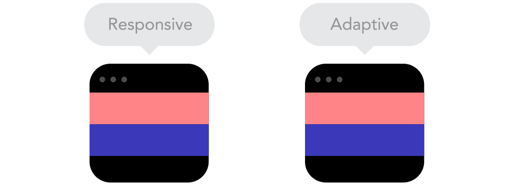
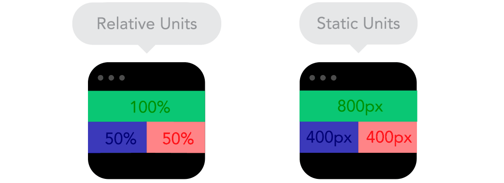
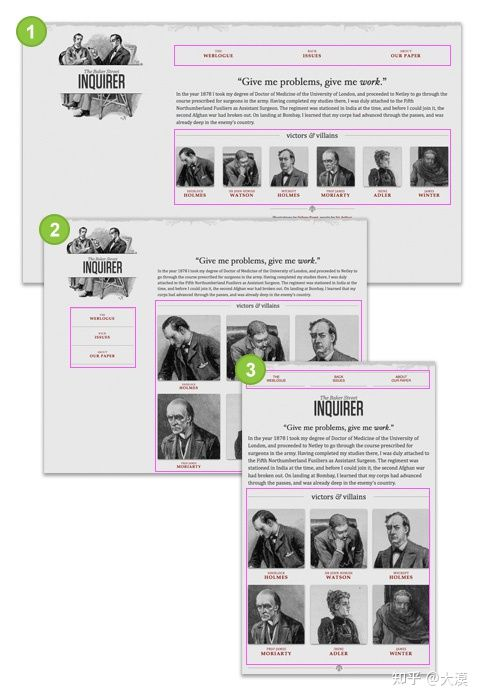

<!--
 * @Author: shenxh
 * @Date: 2021-12-13 17:21:59
 * @LastEditors: shenxh
 * @LastEditTime: 2021-12-15 16:59:34
 * @Description: 页面布局
-->

- [布局分类](#布局分类)
  - [静态布局（Static Layout）](#静态布局static-layout)
    - [特点](#特点)
    - [缺点](#缺点)
  - [流体布局（Liquid Layout）](#流体布局liquid-layout)
    - [特点](#特点-1)
    - [缺点](#缺点-1)
  - [rem 布局](#rem-布局)
    - [特点](#特点-2)
    - [应用](#应用)
  - [自适应布局（Adaptive Layout）](#自适应布局adaptive-layout)
    - [特点](#特点-3)
    - [设计](#设计)
  - [响应式布局（Responsive Layout）](#响应式布局responsive-layout)
    - [特点](#特点-4)
    - [举例](#举例)
    - [代码演示](#代码演示)

# 布局分类

## 静态布局（Static Layout）
即传统 Web 设计, 网页上的所有元素的尺寸一律使用 "px" 作为单位

### 特点
不管浏览器尺寸具体是多少, 网页布局始终按照最初写代码时的布局来显示

### 缺点
不能很好的适配未知分辨率的设备, 比如: 同时适配 PC端、pad端、移动端等

## 流体布局（Liquid Layout）
使用百分比来控制 Web 页面布局（控制元素大小）

### 特点
屏幕分辨率变化时，页面里元素的大小会变化而但布局不变

### 缺点
如果屏幕太大或者太小, 可能会导致元素无法正常显示

## rem 布局
rem 是一种相对长度单位, 可以实现元素宽高等比例缩放, 从而完成不同宽度屏幕的适配

### 特点
rem 是元素相对于 html 标签文字的大小, 所以我们改变 html 文字的大小, 就可以改变所有用 rem 设置的尺寸的大小

### 应用
做移动端项目时, rem 布局是一个不错的选择

## 自适应布局（Adaptive Layout）
自适应布局是网页内容根据设备的不同而进行适应

### 特点
屏幕分辨率变化时, 页面里面元素的位置会变化, 而大小不会变化

### 设计
使用多个 ".css" 文件来描述布局, 借助 JavaScript 来判断视窗大小, 在不同条件下引用不同的 CSS 文件

## 响应式布局（Responsive Layout）
通过 CSS媒体查询来判断，在不同条件下运用不同的 CSS 样式规则

### 特点
响应式 Web 设计不是单独的技术，它是描述 Web 设计的一种方式、或者是一组最佳实践的一个词，它是用来建立可以响应查看内容的设备的样式的一个词

+ 响应式设计和自适应设计


+ 内流是流动的（或者说是流式的）


+ 尽可能采用相对单位


> 注: CSS 中的相对单位有很多种，比如我们熟悉的 `%`, `rem`, `em` 以及 `vw`, `vh` 等

+ 带断点和不带断点


+ 最大值和最小值


### 举例


### 代码演示
下面代码展示了不同分辨率下的不同背景色
```
@media screen and (max-width: 200px) {
    body {
        background: #f00;
    }
}
@media screen and (min-width: 200px) and (max-width: 400px) {
    body {
        background: #f60;
    }
}
@media screen and (min-width: 400px) and (max-width: 600px) {
    body {
        background: #ff0;
    }
}
@media screen and (min-width: 600px) and (max-width: 800px) {
    body {
        background: #0f0;
    }
}
@media screen and (min-width: 800px) and (max-width: 1000px) {
    body {
        background: #0ff;
    }
}
@media screen and (min-width: 1000px) and (max-width: 1200px) {
    body {
        background: #00f;
    }
}
@media screen and (min-width: 1200px) {
    body {
        background: #f0f;
    }
}
```
