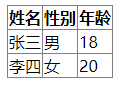
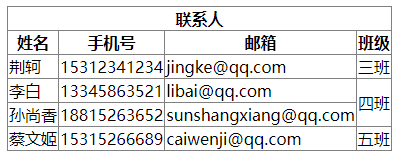

<!--
 * @Author: shenxh
 * @Date: 2021-12-13 16:47:50
 * @LastEditors: shenxh
 * @LastEditTime: 2021-12-15 17:02:06
 * @Description: HTML 表格
-->

<!-- TOC -->

- [HTML 表格](#html-表格)
  - [标签](#标签)
    - [`<table>` 标签](#table-标签)
      - [属性](#属性)
    - [`<tr>` 标签](#tr-标签)
    - [`<th>` 标签](#th-标签)
      - [属性](#属性-1)
    - [`<td>` 标签](#td-标签)
      - [属性](#属性-2)
  - [扩展](#扩展)

# HTML 表格
```
<!-- border-collapse: collapse; 合并单元格边框 -->
<table border="1" style="border-collapse: collapse">
  <tr>
    <th>姓名</th>
    <th>性别</th>
    <th>年龄</th>
  </tr>
  <tr>
    <td>张三</td>
    <td>男</td>
    <td>18</td>
  </tr>
  <tr>
    <td>李四</td>
    <td>女</td>
    <td>20</td>
  </tr>
</table>
```
页面效果:



## 标签

### `<table>` 标签
`<table>` 标签定义 HTML 表格

一个 HTML 表格包括 `<table>` 元素，一个或多个 `<tr>`、`<th>` 以及 `<td>` 元素

#### 属性
|属性|值|描述|
|-|-|-|
|`border`|*number*|规定表格单元是否拥有边框|

### `<tr>` 标签
`<tr>` 标签定义 HTML 表格中的行。

一个 `<tr>` 元素包含一个或多个 `<th>` 或 `<td>` 元素

### `<th>` 标签
`<th>` 标签定义 HTML 表格中的表头单元格

`<th>` 元素中的文本通常呈现为粗体并且居中

#### 属性
|属性|值|描述|
|-|-|-|
|`colspan`|*number*|表头单元格可横跨的列数|
|`rowspan`|*number*|表头单元格可横跨的行数|

### `<td>` 标签
`<td>` 元素中的文本通常是普通的左对齐文本

#### 属性
|属性|值|描述|
|-|-|-|
|`colspan`|*number*|表头单元格可横跨的列数|
|`rowspan`|*number*|表头单元格可横跨的行数|

## 扩展
合并单元格示例:
```
<table border="1" style="border-collapse: collapse">
  <!-- 表头: tr>th -->
  <tr>
    <th colspan="4">联系人</th>
  </tr>
  <tr>
    <th>姓名</th>
    <th>手机号</th>
    <th>邮箱</th>
    <th>班级</th>
  </tr>

  <!-- 表体: tr>td -->
  <tr>
    <td>荆轲</td>
    <td>15312341234</td>
    <td>jingke@qq.com</td>
    <td>三班</td>
  </tr>
  <tr>
    <td>李白</td>
    <td>13345863521</td>
    <td>libai@qq.com</td>
    <td rowspan="2">四班</td>
  </tr>
  <tr>
    <td>孙尚香</td>
    <td>18815263652</td>
    <td>sunshangxiang@qq.com</td>
  </tr>
  <tr>
    <td>蔡文姬</td>
    <td>15315266689</td>
    <td>caiwenji@qq.com</td>
    <td>五班</td>
  </tr>
</table>
```
页面效果:


