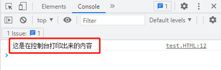
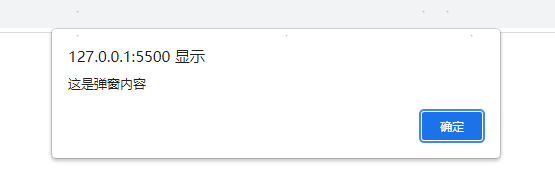

<!--
 * @Author: shenxh
 * @Date: 2021-12-17 09:26:46
 * @LastEditors: shenxh
 * @LastEditTime: 2021-12-17 10:39:55
 * @Description: 输出
-->

- [控制台打印](#控制台打印)
- [警告框](#警告框)
- [`document.write`](#documentwrite)
- [`元素.innerHTML`](#元素innerhtml)

# 控制台打印
将数据打印到控制台是我们在实际开发时最常用的方式

```
console.log('这是在控制台打印出来的内容');
```
按 `F12` 打开控制台, 点击 `Console` 菜单后即可看到打印的内容



# 警告框
将数据以弹窗的形式显示出来

```
alert('这是弹窗内容');
```



# `document.write`
将内容添加至页面中, 不会影响页面原内容

```
document.write('将内容添加至页面中');
```

# `元素.innerHTML`
替换目标元素中的内容

```
<span id="item">这是原数据</span>
```
```
document.getElementById('item').innerHTML = '这是新数据';
```
