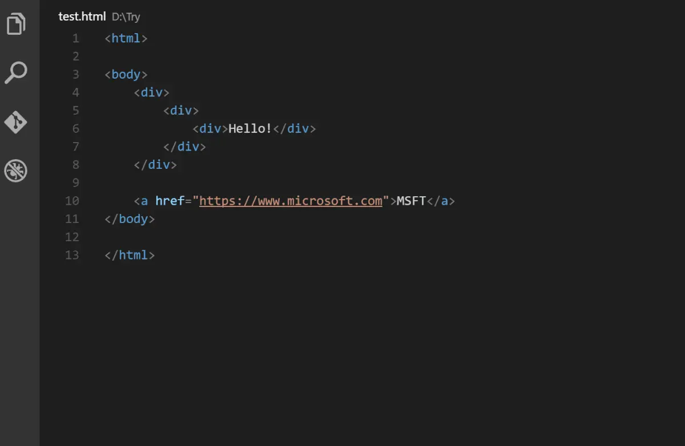
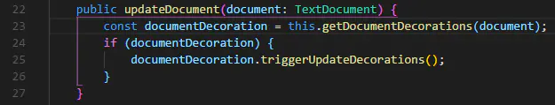
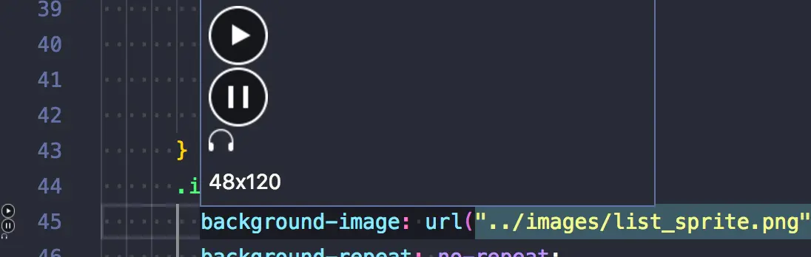

<!--
 * @Author: shenxh
 * @Date: 2021-12-16 13:33:23
 * @LastEditors: shenxh
 * @LastEditTime: 2022-02-16 15:56:57
 * @Description: 必备插件推荐
-->

- [插件安装方法:](#插件安装方法)
- [插件推荐](#插件推荐)

# 插件安装方法:
打开扩展(`Ctrl`+`Shift`+`X`), 搜索插件名称, 点击"安装"即可

# 插件推荐
|插件|说明|效果|
|:-:|:-|:-:|
|Atom One Dark Theme|一款很漂亮的主题插件||
|Auto Close Tag|自动添加HTML / XML关闭标签||
|Auto Rename Tag|自动重命名配对的HTML / XML标签||
|Beautify|格式化代码 [(查看使用方法)](https://www.jianshu.com/p/34ad34528549)||
|Bracket Pair Colorizer|颜色识别匹配括号||
|Code Runner|非常强大的一款插件，能够运行多种语言的代码片段或代码文件：C，C ++，Java，JavaScript，PHP，Python，Perl，Ruby，Go等等 安装完成后，右上角会出现：▶||
|change-case|虽然 VSCode 内置了开箱即用的文本转换选项，但其只能进行文本大小写的转换。而此插件则添加了用于修改文本的更多命名格式，包括驼峰命名、下划线分隔命名，snake_case 命名以及 CONST_CAS 命名等||
|Chinese (Simplified) Language Pack for Visual Studio Code|中文简体语言包||
|Color Info|这个便捷的插件，将为你提供你在 CSS 中使用颜色的相关信息。你只需在颜色上悬停光标，就可以预览色块中色彩模型的（HEX、 RGB、HSL 和 CMYK）相关信息了||
|CSS Peek|使用此插件，你可以追踪至样式表中 CSS 类和 ids 定义的地方。当你在 HTML 文件中右键单击选择器时，选择“ Go to Definition 和 Peek definition ”选项，它便会给你发送样式设置的 CSS 代码||
|Debugger for Chrome|前端调试 [(查看使用方法)](https://www.jianshu.com/p/66033d4949bf)||
|Easy LESS|使用 less 语法开发, 对于不支持 less 的项目非常有用 (比如: 微信小程序)|微信小程序配置:  1. 进入 `setings.json`, 在 `less.compile` 中添加 `"outExt": ".wxss"` 2. 新建一个 `.less` 文件, 写入样式后会在同级目录自动生成 `.wxss` 文件|
|ESLint|EsLint可以帮助我们检查Javascript编程时的语法错误。比如：在Javascript应用中，你很难找到你漏泄的变量或者方法。EsLint能够帮助我们分析JS代码，找到bug并确保一定程度的JS语法书写的正确性||
|filesize|在底部状态栏显示当前文件大小，点击后还可以看到详细创建、修改时间||
|Git History|以图表的形式查看 git 日志||
|GitLens — Git supercharged|显示文件最近的 commit 和作者，显示当前行 commit 信息||
|HTML Boilerplate|通过使用 HTML 模版插件，你就摆脱了为 HTML 新文件重新编写头部和正文标签的苦恼。你只需在空文件中输入 html，并按 Tab 键，即可生成干净的文档结构||
|HTML CSS Support|html 代码自动补全以及 class 智能提示||
|HTMLHint|HTML 代码格式检测||
|HTML Snippets|代码自动填充||
|htmltagwrap|在选中HTML标签中外面套一层标签  "Alt + W"  ("Option + W" for Mac) ||
|Image Preview|鼠标移到路径里显示图像预览||
|Indenticator|突出目前的缩进深度||
|intelliSense for CSS class names in HTML|把项目中 css 文件里的名称智能提示在 html 中||
|JavaScript (ES6) code snippets|es6代码片段||
|koroFileHeader|文件头部注释 (不会被格式化)||
|Live Server|浏览器实时刷新||
|Markdown Image|将粘贴板中的图片以本地存储的方式创建 快捷键: `Shift` + `Alt` + `V`||
|Markdown All in One|超级强大的 Markdown 插件, 可生成目录 (`Ctrl` + `Shift` + `P`, 输入 `>Markdown All in One: 创建目录`)||
|minapp|微信小程序标签、属性的智能补全（同时支持原生小程序、mpvue 和 wepy 框架，并提供 snippets）||
|Node.js Modules Intellisense|可以在导入语句中自动完成JavaScript / TypeScript模块||
|npm Intellisense|require 时的包提示||
|Path Intellisense|路径自动补全||
|Power Mode|代码输入特效||
|Prettier - Code formatter|格式化工具, 统一代码规范, 团队开发必备||
|Quokka.js|Quokka 是一个调试工具插件，能够根据你正在编写的代码提供实时反馈 使用方法: ctrl+shift+p 输入 quokka 选择 new javascript 就可以了||
|Regex Previewer|这是一个用于实时测试正则表达式的实用工具。它可以将正则表达式模式应用在任何打开的文件上，并高亮所有的匹配项||
|Settings Sync|个人配置同步 [查看使用方法](https://www.jianshu.com/p/2642442b17d5)||
|SVG Viewer|此插件在 Visual Studio 代码中添加了许多实用的 SVG 程序，你无需离开编辑器，便可以打开 SVG 文件并查看它们。同时，它还包含了用于转换为 PNG 格式和生成数据 URI 模式的选项||
|Vue 2 Snippets|Vue2 代码片段补全||
|Vetur|Vue 语法高亮显示, 语法错误检查, 代码自动补全 (配合 ESLint 插件效果更佳)||
|vscode-fileheader|顶部注释模板，可定义作者、时间等信息，并会自动更新最后修改时间 快捷键: Ctrl+Alt+i (默认信息可在 文件→首选项→设置 中修改)||
